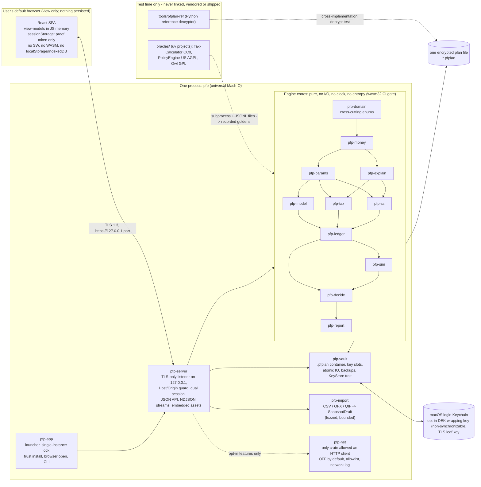

# ARCHITECTURE

*How the application is built: the stack, the crate graph and its enforced constraints, the engine API and its purity/determinism contract, the request flow, the extension points, the build and release pipeline, and the validation corpus and licence boundary. Date: 2026-09-17. Companion to `PLAN.md` (what and when) and `DECISIONS.md` (why); the five specifications (`DOMAIN-MODEL.md`, `ENGINE-SPEC.md`, `SIMULATION-SPEC.md`, `SECURITY.md`, `TESTING.md`) are written against all three. All examples are synthetic or published third-party worked examples.*

**Terminology used throughout (standing definition).** "The binary" or "the release" always means one thing: a **local web application for macOS**, shipped as a single self-contained executable (universal: Apple Silicon + Intel). Launching it starts a web server bound to loopback, serves the embedded web app over TLS, and opens the default browser. The user interface is a web app in the browser. It is not a native desktop GUI and not an Electron/Tauri window, and nothing else has to be installed. The optional `.app` wrapper is a notarization container and Finder launcher around the byte-identical executable (no second executable, no runtime, no WebView, no window, no Dock icon); Tauri, Electron, any WebView host and any browser-side engine are refused.

---

## 1. Stack decisions at a glance

| Layer | Choice | Rationale (full reasoning in `DECISIONS.md`) |
|---|---|---|
| Backend / engine language | **Rust** (toolchain pinned in `rust-toolchain.toml`, floor 1.84) | One static Mach-O per architecture joined with `lipo`; exhaustive sum types; compiler-enforced money newtype; pure-Rust TLS/AEAD/KDF (no OpenSSL, no CMake); `zeroize`; `proptest`, `insta`, `cargo-mutants`, `cargo-fuzz`, `cargo-deny`. ADR-001 |
| HTTP server | `axum` on `tokio`/`hyper`, `tower-http`, `rustls` with the `ring` provider, `rcgen` | Release profile compiles only a TLS acceptor. ADR-006 |
| API style | JSON over HTTPS under `/api/v1`; long runs stream **NDJSON over `fetch`** (not `EventSource`/WebSocket, which cannot carry the proof header) | ADR-015, ADR-017 |
| API contract | OpenAPI generated from Rust DTOs (`utoipa`), snapshot-tested; client types by `openapi-typescript`; the plan schema is published as JSON Schema via `schemars` | A DTO change breaks the front-end build, not a user session. ADR-017 |
| Front end | **Vite + React + TypeScript**, TanStack Query, hash routing, plain CSS modules (no runtime CSS-in-JS), built to hashed static assets | AI-assistance depth and ecosystem; server-owned state; the front end never computes money and never applies patches. ADR-002 |
| Charts | **Observable Plot** (fan bands via `areaY`, EMR curve, tornado, funded-ratio strip); hand-built SVG for the next-dollar waterfall and scenario diff; `d3-sankey` only if a cash-flow map is built | One charting dependency; renders SVG without `eval` under the strict CSP |
| Reports | Print-CSS routes over pinned view-models (`/report/one-page`, `/report/full`, `/report/review/:id`); the browser prints to PDF | No PDF library in the binary |
| Money | `Cents(i64)`; exact `Ratio{num,den}`; `RoundingRule` as data; floats fenced to four places | ADR-007 |
| Randomness / math | `ChaCha8Rng` with stream = path index; in-repo Wichura AS241 inverse normal CDF; pure-Rust `libm` for `exp`/`ln` | Mechanism for bit-identity across Apple Silicon and Intel and across thread counts. ADR-013 |
| Plan file | Custom documented container `.pfplan`: Argon2id key slots wrapping a random DEK, XChaCha20-Poly1305 STREAM, per-section HKDF subkeys, DEFLATE, 64 KiB bucket padding | RustCrypto `argon2`, `chacha20poly1305`, `hkdf`, `sha2`; `zeroize`, `secrecy`; `flate2` with the pure-Rust backend. ADR-005 |
| Key store | `trait KeyStore`; `security-framework` implementation under `cfg(target_os = "macos")`; other targets return `Unsupported` | Portable at zero v1 cost |
| Asset embedding | `rust-embed` (compressed, content-hashed), build-time SHA-256 manifest -> strong ETags and generated CSP | `build.rs` fails a release build if `web/dist` is stale |
| Oracles | One `uv` project per oracle, Python **3.13** fetched by `uv` (not the system interpreter), out of process, record/verify split | ADR-004, ADR-012 |
| Licence | **Apache-2.0** | ADR-004 |

---

## 2. Component diagram



Crate-level constraints are part of the architecture and are enforced, not promised:

| Constraint | Enforcement |
|---|---|
| Engine crates perform no I/O and read no clock or entropy | CI builds them for `wasm32-unknown-unknown`; `#![forbid(unsafe_code)]`; clippy `disallowed_types`/`disallowed_methods` |
| Only `pfp-vault` touches plan bytes on disk | Code review plus a lint on `std::fs` use outside `pfp-vault`, `pfp-app`, `xtask` |
| Only `pfp-server` opens sockets | Same lint for `std::net`/`tokio::net` |
| Only `pfp-net` may depend on an HTTP client | `cargo-deny` `bans` on client crates for every other workspace member |
| No copyleft reaches a shipped artifact | `cargo-deny` licence allowlist; per-package `license-checker` for npm; SBOM assertion at the release gate; `oracles/` and `tools/` are not workspace members and are excluded from release archives |
| No dollar constants in engine code | Lint forbids dollar literals in engine crates outside tests; constants come from `params/` |
| No plan-file container bytes exist in the repository or in a release archive | Commit hook on the leading magic, plus a CI and release-gate scan for the magic sequence anywhere in the tree (including `oracles/` and `tools/`) and in every packaged archive. **No allowlist** (section 8) |
| Cross-cutting domain enums are defined once | `FilingStatus`, `Owner`, `PersonId`, `AssetClass`, `TaxType`, `Year`, `Seed` live in `pfp-domain`. A CI check asserts each name resolves to the `pfp-domain` definition in every crate that uses it, so a second definition or a boundary conversion shows up as a failure rather than as a review miss |

---

## 3. Repository layout

```
Cargo.toml  rust-toolchain.toml  deny.toml  lefthook.yml  .gitleaks.toml  LICENSE  NOTICE
crates/
  pfp-domain/    cross-cutting domain enums and aliases, defined once: FilingStatus, Owner, PersonId,
                 AssetClass, TaxType, Year, Seed                                   (no deps beyond serde)
  pfp-money/     Cents, Ratio, RoundingRule, mul_ratio, Cents::grow                (serde + pfp-domain)
  pfp-params/    parameter tables, vintages, projection/uprating, provenance, override view
  pfp-explain/   Line trace node, LineId/ParamRef/LedgerRef/TaxLineRef/AssumptionRef,
                 Explanation tree, flip-value bisection helper, ValidationBasis
  pfp-model/     plan schema (serde + schemars), MonthRef, validation, migration chain,
                 typed actions -> RFC-6902 ops, scenario resolution with fact-path allowlist,
                 change-log entry types, snapshot types, result pins, inputsHash (RFC 8785 + SHA-256)
  pfp-tax/       federal worksheets -> named lines; payroll/FICA/SE; marginal() and EMR;
                 trait StateTax, Fidelity, NoIncomeTax, EffectiveRate, DeclarativeState interpreter, states/
  pfp-ss/        AIME/PIA, claim factors, earnings test, spousal/survivor, claiming grid
                 (created M3: the claim-age factors, ss.fra.retirement and the BenefitAtAge -> PIA
                  back-solve; AIME/PIA from the earnings record, spousal/survivor and the earnings
                  test at M5; the claiming grid at M8)
  pfp-ledger/    project(): annual loop, monthly sub-engines (debt, SS, coverage switches),
                 ContributionPolicy / WithdrawalPolicy evaluation, first-death state machine, event bundles;
                 declares simulate() and the strategy traits (ReturnGenerator, SpendingRule,
                 WithdrawalOrder, Criterion, GlidePath) plus their M3 built-ins                 (traits frozen M2)
  pfp-sim/       ReturnGenerator implementations, RNG streams, AS241, runner, metrics,
                 Wilson intervals, bisection solvers, scorecard, later spending rules           (created M6)
  pfp-decide/    next-dollar, Roth vs Traditional, debt vs invest, conversions, claiming re-rank,
                 allocation/reallocation -> Recommendation + Explanation  (insurance grid: 1.1)
  pfp-report/    deterministic view-models: One-Page Plan, Full, Review, validation report    (created M4)
  pfp-vault/     container, KDF, key slots, KeyStore trait (+ macOS impl), atomic save, backups
  pfp-import/    CSV/OFX/QIF parsers -> SnapshotDraft; trait Connector, SecretRef             (created M4)
  pfp-net/       allowlisted HTTP client, per-feature toggles, in-app network log            (created with the first opt-in feature)
  pfp-server/    axum app, TLS bootstrap, session, middleware, API DTOs, OpenAPI, embedded assets
  pfp-app/       bin `pfp`: launcher, single-instance lock, trust install/remove, browser open,
                 CLI: serve | vault verify | vault rekey [--rotate-dek [--discard-backups]] |
                      vault compact [--purge-before <date>] | trust remove | export | --sbom
xtask/           dist, build-web, oracle record, fixture transliteration, vintage lock, schema/OpenAPI export,
                 persona generator (seeded), validation-report build
web/             Vite + React + TypeScript SPA (src/, generated api types, no storage APIs)
e2e/             Playwright suites driving the real binary (security contract + persona journeys)
fuzz/            cargo-fuzz targets + committed synthetic corpora (vault header, patch/migrations, CSV, OFX, QIF)
params/          vintages/<name>/*.toml, VINTAGES.lock (sha256 per file), provenance/ (archived public sources + checksums),
                 states/*.toml (DeclarativeState modules), assumptions/*.toml (CMA and inflation vintages)
fixtures/        tier1/ tier2/ tier3/ personas/ plans/plan.v{N}.json plans/demo.plan.json
                 (synthetic or published third-party only; every plan fixture is plaintext JSON, never a container)
oracles/         taxcalc/ policyengine/ owl/   (one uv project each; never workspace members; never shipped)
tools/pfplan-ref/  ~100-line Python reference decryptor (test oracle + user escape hatch; never shipped in a release).
                 Its test data is written by the test run and deleted with the temp directory; no `.pfplan` is committed
packaging/       Info.plist (LSUIElement), icon, DMG layout, entitlements (empty), notarization scripts
docs/            PLAN, ARCHITECTURE, DECISIONS, threat-model, data-classification, pfplan-format-spec,
                 assumption catalogue, contributor rules (synthetic data only; AI-assistance protocol)
.github/workflows/  ci, nightly (oracle re-record, full-history gitleaks, fuzz), release
```

Crates are created in the milestone that first needs them; they are not scaffolded empty. `pfp-domain` is created at M0, because M0's `schedule_tax(year, status, taxable_income)` already needs `FilingStatus`.

**Dependency direction** is strictly downward from `pfp-app` to `pfp-domain`. `pfp-domain` through `pfp-report` are the engine.

**Cross-cutting domain enums have exactly one home.** A type that both a lower and a higher crate need is defined in `pfp-domain` and re-exported, never redefined or converted at a boundary. This is what keeps the graph downward: `FilingStatus` is a parameter of `federal(year, status, …)` in `pfp-tax` **and** a stored field of `Household` in `pfp-model`, and `pfp-tax` does not depend on `pfp-model`; `Owner` and `PersonId` tag rows in `pfp-model` and are read by `pfp-ledger`; `AssetClass` is a holding's field in `pfp-model` and the index of a return vector in `pfp-sim`. `DOMAIN-MODEL.md` and `SIMULATION-SPEC.md` document these types where they are used, but the definition is `pfp-domain`'s and they re-export it. `AssetClass` keeps the guarantee `SIMULATION-SPEC.md` §2.1 attaches to it: a closed, ordered `#[repr(u8)]` registry whose discriminants are part of the RNG addressing contract, never reordered, extended only by appending, with the reserved tail and `MAX_CLASSES` fixed at the same time.

`simulate()` is **declared in `pfp-ledger`**, beside the strategy traits, so that seam S6 can freeze on schedule at M2 while `pfp-sim` is still unwritten: at M2 it runs the mean path over a one-year horizon through the trait objects a `RuleRegistry` carries. `pfp-sim` is created at M6 and supplies generators, the runner and the metrics; no dependency arrow is reversed and no frozen signature moves.

---

## 4. The core engine API and its purity/determinism contract

### 4.1 Signatures

```rust
/// Base facts + ordered scenario chain -> validated, fully resolved plan.
pub fn resolve(base: &Plan, chain: &[Scenario]) -> Result<ResolvedPlan, ValidationErrors>;

/// The whole model: a pure function. Frozen in M2 (seam S6).
pub fn project(
    plan:        &ResolvedPlan,
    assumptions: &AssumptionSet,   // immutable vintage + visible plan-level overrides
    params:      &ParamView,       // vintage ids + override layer; uprated per (year, inflation path)
    path:        &ReturnPath,      // returns[t][asset_class], inflation[t], optional death years
    opts:        &ProjectOpts,     // horizon, success criterion, trace: None | Summary | Full
) -> Projection;                   // ledger rows, FederalReturn/StateReturn per year (named lines),
                                   // per-year metrics, trace, pins

/// Common random numbers by construction: one shock tensor shared by every plan in the slice.
/// Declared in pfp-ledger beside the strategy traits (section 3); pfp-sim supplies generators from M6.
pub fn simulate(
    plans: &[ResolvedPlan], assumptions: &AssumptionSet, params: &ParamView,
    generator: &dyn ReturnGenerator, seed: Seed, n_paths: u32, opts: &SimOpts,
) -> SimResult;                    // calls project() per path with trace None; summaries, never paths

/// Tax: named lines in, named lines out. Frozen in M1 (seam S3) *with the trace parameter in place*.
pub fn federal(year: Year, status: FilingStatus, inputs: &TaxInputs, params: &ParamView,
               trace: TraceLevel) -> FederalReturn;
pub fn payroll(year: Year, person_wages: &[PersonWages], params: &ParamView,
               trace: TraceLevel) -> PayrollLines;
pub fn marginal(base: &TaxInputs, delta: IncomeDelta, .., trace: TraceLevel) -> MarginalRate;  // twice

/// Decisions return stored objects with machine-checked explanations. Frozen in M2 (seam S7).
pub fn next_dollar(plan: &ResolvedPlan, proj: &Projection, year: Year, surplus: Cents,
                   policy: &ContributionPolicy) -> Vec<Recommendation>;
```

**`trace` is on the tax functions, not only on `ProjectOpts`, and it is frozen there at M1.** Under `TraceLevel::None` the return carries its totals and every typed accessor but leaves `lines` empty, so no `Line` node is constructed on a Monte Carlo path; under `Summary` or `Full` the named lines are built as usual. A tier-1 property asserts that the two modes agree **to the cent on every typed accessor**, which is what makes the cheap mode safe to use as the default inside `simulate()`. The parameter exists from the first day of the seam precisely so that the cheapest performance remedy — suppressing trace allocation — never requires reopening a frozen signature (ADR-007, rung 0). Later worksheets remain additions, never signature changes.

`TaxInputs` carries **every income character from M1** (wages, SE income, interest, tax-exempt interest, ordinary and qualified dividends, short- and long-term gains, IRA/pension distributions, conversions, Social Security, rental, vest income with withholding, ISO spread, itemizable amounts), zero until modelled, so new worksheets are additions and never signature changes. Inputs the function does not yet model produce a `NotModelled` flag on the return, never silence.

`project()` implements the nine-step annual loop: (1) people state (alive, age, employed, coverage regime, filing status); (2) gross income including RMDs on the prior 12/31 balance and planned conversions; (3) pre-tax payroll flows; (4) expenses and goals by priority, debt service; (5) `federal()` (whose return already contains NIIT and Additional Medicare as its own `f8960`/`f8959` lines — one owner per tax, `ENGINE-SPEC.md` §2.2) + state + IRMAA on the t-2 MAGI + PTC reconcile; (6) surplus -> `ContributionPolicy`, deficit -> `WithdrawalPolicy`; (7) growth and rebalancing; (8) carried state (basis and lots, Roth ledger with five-year clocks, loss carryforward, two years of MAGI, HSA receipts); (9) an exportable ledger row. **Nominal internally, real for display**, because brackets, RMDs, fixed debt payments and the never-indexed thresholds are nominal facts. Monthly sub-engines run only where rules are monthly (Social Security, amortization, the 65th-birthday coverage switch).

### 4.2 The trace and explanation contract

```rust
struct Line { id: LineId /* "pub915.ws1.l9" */, label: &'static str, value: Cents,
              inputs: SmallVec<[LineId; 4]>, params: SmallVec<[ParamRef; 2]>, rounding: Option<RuleId> }

Recommendation { id, kind, scenarioId, year, action, dollars, tier, r_u, explanation, pins, basis: ValidationBasis, status }
Explanation   { claim, because: [Reason{templateKey, values: SmallVec<[Bound; 4]>}],
                thresholds: [ParamRef|AssumptionRef], alternatives: [{option, r_u, whyNot}],
                flip: [{input, currentValue, flipValue}], caveats[], omissions[] }
Bound         { name, value: Cents|Ratio, ref: LedgerRef|TaxLineRef|ParamRef|AssumptionRef }
```

One `Line` structure serves three purposes: the fixture intermediate (Pub 915 Worksheet 1 line by line), the UI audit trail (the Explain panel on any number), and the effective-marginal-rate machinery.

**The reference travels with the value, not with the reason.** A realistic reason cites several numbers at once — a rendered template comparing two options names each option's `r_u` and the threshold that separates them, which is three different cells — so a `Reason` carries a list of named `Bound`s and **each `Bound` carries its own `ref`**. One `ref` shared by a list of values could only ever be satisfied when every value in the reason was equal, which would force each multi-value explanation to be split into one-value fragments and defeat the template design.

**Reconciliation invariant**, property-tested over all personas, in three parts:

1. **Agreement.** Every `bound.value` equals the cell `bound.ref` resolves to in the same projection — ledger cell, tax line, parameter or assumption.
2. **Coverage.** Every placeholder in the template named by `templateKey` has a `Bound` with that `name`.
3. **Reachability.** Every `Bound` is rendered by its template. A bound nothing displays proves nothing, so an unused bound fails the property exactly as a missing one does.

Parts 2 and 3 are what stop the invariant from being satisfied by an explanation that displays none of what it proves. Together they are the only test oracle the decision code has, because the differentiator has no published fixtures to check it against (ADR-016).

**Flip values** are found by bisection over the named input (for Roth vs Traditional: the future marginal rate at which the answer reverses). Deterministic runs use `Full` trace; Monte Carlo paths use `TraceLevel::None`, which is passed all the way down into `federal()` (4.1) and not merely held on `ProjectOpts`, and any single path can be re-run with `Full` from `(seed, path index)`. No LLM participates at runtime.

### 4.3 Purity, determinism and the performance budget

| # | Rule | Enforced by |
|---|---|---|
| D1 | Engine crates have no filesystem, network, clock, environment, entropy or global mutable state. The plan's `asOf` date and the seed are inputs. | `wasm32-unknown-unknown` CI build; `forbid(unsafe_code)`; clippy disallow lists |
| D2 | Same inputs -> **bit-identical** outputs on `aarch64` and `x86_64`, for any thread count. | CI on both runners comparing `SimResult` hashes; thread-count matrix test |
| D3 | Money is `Cents(i64)`; statutory rates are exact `Ratio{num: i64, den: i64}` parsed from decimal strings or fractions (`"0.0765"`, `"5/900"`); `cents.mul_ratio(r, rule)` computes in `i128` and rounds **once** with a named `RoundingRule{increment, direction: Down\|Up\|HalfUp\|HalfEven\|Nearest, basis: Amount\|IncreaseOverBase}` stored as data beside the parameter. `Cents * Cents` does not compile. | Type system; property tests; rounding-table Tier 1 fixture |
| D4 | Composite statutory factors are reduced to one exact rational at point of use (e.g. the claim factor `1 - min(m,36) x 5/900 - max(m-36,0) x 5/1200`), then applied once. | Named CI gate `ss_claim_factor_knife_edge` (PIA 1,000 -> 700) |
| D5 | `f64` appears in exactly four places: (a) return and inflation generation, (b) the **two named** `f64`-to-money entry points in `pfp-money` — the growth step `Cents::grow(self, factor: f64) -> Cents` and the solver/spending-rule constructor `Cents::from_f64_half_even(x: f64) -> Cents`, both rounding half-even at the cent (`SIMULATION-SPEC.md` §2.6; a third entry is a design change, not a refactor), (c) statistics, (d) solvers and spending-rule arithmetic. | Lint on `f64` in `pfp-tax`, `pfp-ss`, `pfp-money` (except `grow` and `from_f64_half_even`) |
| D6 | `exp`/`ln`/`pow` come from the pure-Rust `libm` crate, never the platform libm; no `mul_add`; normal deviates from the in-repo AS241 inverse CDF with golden vectors (`rand_distr` is not used: it does not promise value stability across versions). | Golden vectors; clippy disallowed methods |
| D7 | PRNG is `ChaCha8Rng`, seeded from the persisted scenario seed with **stream id = path index**; floating-point aggregation proceeds in path-index order (no parallel float reduction). | Thread-count independence test |
| D8 | Engine output never depends on hash-map iteration order: `BTreeMap`/`IndexMap` in engine crates. | clippy disallowed types |
| D9 | The canonical tax computation is the rate-schedule formula. IRS Tax Table mode ($50-bin midpoints under $100,000) exists only in the validation adapter. | Adapter lives under `fixtures/` tooling, not in `pfp-tax` |
| D10 | `inputsHash` = SHA-256 over RFC 8785 canonical JSON of the resolved plan, overrides and assumption set; a no-op patch leaves it unchanged. | Property test |
| D11 | Parallelism is a driver concern: `pfp-sim` exposes a sequential core; the `rayon` fan-out is behind the `parallel` feature (off in the `wasm32` build). | Feature matrix in CI |
| D12 | A probability cannot be constructed or serialized without its magnitude companions (`max_cut`, worst-decile cut, shortfall timing, Wilson interval). | Type design + API-level serialization test |

#### Performance budget and the tax-evaluation contract

**`ENGINE-SPEC.md` §2.4 is the single owner of the tax-call budget** — the per-ledger-year mean evaluation counts and the hard per-year evaluation cap that bounds them — as `DECISIONS.md` C2 records. This subsection owns only what it uniquely holds: the **wall-clock gates** below and the **per-evaluation derivation** (5.33 µs, 13.3 µs per ledger-year) that C2 cites back to; for the counts it cites §2.4, and `SIMULATION-SPEC.md` §9 does the same, because three documents quoting three budgets for one gate is how a shortfall reaches M6 with the tax kernel already written.

**Gates (CI `criterion`, Apple Silicon):** 1,000 x 60 under 250 ms; 10,000 x 60 under 2 s on eight cores; insurance grid (about 1,440 deterministic runs) under 5 s — the grid gate travels with the `disable` bundle to **1.1** (`PLAN.md` M10, section 5) and is not a v1 gate.

**The normative unit is the ledger-year, not the tax call:** one simulated ledger-year in **at most 27 microseconds of core time, including every tax call it makes**. That is the 10,000 x 60 gate restated (16 core-seconds over 600,000 ledger-years = 26.7 microseconds), and it is what CI benchmarks, so that work moved out of `federal()` into the loop cannot pass by relabelling.

**Tax evaluations per ledger-year** (a reference copy of the `ENGINE-SPEC.md` §2.4 contract, reproduced so the derivation below reads in one place; §2.4 is the definition site and wins on any difference):

| Year kind | Budget (mean per ledger-year) | What spends it |
|---|---|---|
| Accumulation | **a mean of at most 2** | The federal-state two-pass. Pass 3 is skipped by the standard-deduction shortcut in `ENGINE-SPEC.md` §4.3's federal-state ordering, which is the common case; TierFill surplus routing re-uses the pass-2 return rather than adding a call per filled option |
| Retired | **a mean of at most 3** | The two-pass plus one settle for the gross-up solve. The solve is a secant on the real `federal()`, but its initial guess is the closed-form segment-by-segment solution read from the kink list already present in the pass-2 return, so the seed is free and the first secant evaluation *is* the settle |
| Any | **hard cap 6** | No single ledger-year makes more than six full `federal()` evaluations, counting passes, secant steps, settles and outer cash-loop repeats alike; reaching the cap marks the year `SHORTFALL` |

These are means under the hard per-year evaluation cap, not per-year maxima. Mean across a full horizon: **about 2.5**, and that mean is what the ledger-year gate measures. A retired year whose secant needs a further correction to reach the cent spends a fourth evaluation inside the cap; those years are counted and reported by the benchmark rather than hidden, and the cap and the fallback belong to `ENGINE-SPEC.md` §2.4. The deficit routing, the 59.5 guard, the gross-up solve **and this budget** are specified **once**, in `ENGINE-SPEC.md` §2.4; `SIMULATION-SPEC.md` §13 references that section rather than restating the order, `SIMULATION-SPEC.md` §9 cites the budget rather than legislating it, and the table above is a reference copy of that contract, not a second statement of it.

**`marginal()` sits outside this budget, by exclusion rather than by oversight.** It runs the tax function twice per call, so the two effective-marginal-rate metrics on a ledger row would cost four further evaluations. They are therefore populated **only under `TraceLevel::Summary` or `Full`** — deterministic runs, and single paths re-run for the Explain panel — and left `None` on Monte Carlo paths, which is why the per-path record carries terminal wealth, shortfall and lifetime taxes but no marginal rate. `emr_curve()` is a user-invoked sweep, budgeted with the interactive endpoints and never run inside the path loop.

**The M1 probe is re-based to this contract:** **1,500,000 full `federal()` evaluations at `TraceLevel::None` under 2 s on eight cores and under 8 s single-threaded.** The single-threaded leg is the binding one, and the derivation is written out so that it can be checked rather than re-litigated: 8 core-seconds over 1,500,000 evaluations is **5.33 microseconds each**, and at the 2.5 average that is **13.3 microseconds of tax per ledger-year — half of the 27-microsecond budget**, leaving the other half for the rest of the annual loop. D11 makes parallelism a driver concern, so the eight-core leg checks the `rayon` fan-out rather than the kernel. **The 13.3 figure is the tax share of one ledger-year, not the cost of one evaluation**, and it must not be read as the price of a single `federal()` call. The probe reports `TraceLevel::None` and `Full` separately, because the gap between them is the size of the rung-0 remedy.

If the probe or the M6 gate fails, ADR-007's contingency ladder is triggered **then**, starting at rung 0: suppress `Line` construction under `TraceLevel::None`, which the seam-S3 signature makes available without reopening anything.

The tax kernel is written concretely against `Cents`; **no generic `Amount`/`Money` trait is threaded through it.**

---

## 5. Request flow: UI -> API -> engine -> results

```mermaid
sequenceDiagram
  participant U as User
  participant A as pfp-app
  participant B as Browser SPA
  participant S as pfp-server
  participant V as pfp-vault
  participant E as Engine (pure)

  U->>A: launch (Finder via .app wrapper, or CLI)
  A->>A: single-instance lock, bind 127.0.0.1 (preferred port, else OS-assigned), ensure CA-signed leaf, RLIMIT_CORE=0
  A->>B: open https://127.0.0.1:port/#t=<one-time token, 60 s>
  B->>S: POST /api/v1/session/bootstrap {token}
  S-->>B: Set-Cookie __Host-pfp (Secure, HttpOnly, SameSite=Strict) + proof token
  B->>B: proof -> sessionStorage; history.replaceState clears the fragment
  B->>S: POST /session/unlock {plan, passphrase}  (cookie + X-PFP-Proof, exact Host/Origin)
  S->>V: Argon2id -> KEK -> unwrap DEK -> authenticate header -> decrypt sections
  V-->>S: Plan in backend memory only (secrecy/zeroize; secrets section stays encrypted)
  B->>S: PATCH /plan {typed action}
  S->>E: validate + action -> RFC-6902 ops (pfp-model)
  S->>V: append {timestamp, action, reverseDiff}; atomic save
  B->>S: POST /runs {scenarioIds[], mode, generator, n, seed?, criterion, ephemeral}
  S->>E: resolve() each scenario; pin vintages + seed; project() or simulate() on a blocking pool
  S-->>B: NDJSON progress over fetch, then run id
  B->>S: GET /runs/{id}/ledger | /tax/{year} | /fan | /compare | /scorecard
  S-->>B: view-models (never the raw plan), Cache-Control: no-store
  B->>S: POST /decisions/next-dollar
  S->>E: next_dollar() -> Recommendation[] + Explanation
  B->>S: POST /recommendations/{id}/adopt -> ops appended to Proposed Plan + ActionItem
```

Rules of the flow:

- **Decrypt boundary.** Only the backend process ever holds plaintext. The browser receives view-models over TLS and keeps them in JavaScript memory only. URLs carry opaque ids only.
- **The front end sends typed actions and renders results.** It never applies patches, never computes money, never composes explanations. Validation messages come from the backend validator.
- **Endpoint admission rule.** An endpoint is added only when a screen in the current milestone consumes it. Groups: session, plan facts, import (preview/commit), scenarios, assumptions/params/overrides, runs, decisions, explanations, recommendations/actions, snapshots/reviews, reports (view-model JSON pinned to a snapshot id), export.
- **Run-size contract.** Ephemeral slider runs N = 1,000 (and mark saved results stale); saved runs 5,000; solvers and tails 10,000+. Every rate is returned with its Wilson interval.
- **Stale results.** A stored result whose pins no longer match the running engine, vintages or `inputsHash` is displayed as stale; it is re-run on request with the difference shown, never silently recomputed.
- **Exports and prints** are the one place plaintext leaves the store: user-initiated, preceded by a warning, formula-injection-escaped, recorded in the change log.
- **Session hardening.** Exact `Host` allowlist (else 421); exact `Origin` (else 403); `Sec-Fetch-Site` **scoped by route** (ADR-015, `SECURITY.md` §7.2): on `/api/**` it must be `same-origin` — `none`, `same-site`, `cross-site` and absent are all 403 — while on document and static-asset routes `Sec-Fetch-Site: none` is accepted only with `Sec-Fetch-Mode: navigate` at path `/`, because the first request of every session is a top-level navigation that carries `none`, and an unqualified rule would 403 the launch itself; JSON content type enforced; no `Access-Control-Allow-*` or Private Network Access header ever emitted; CSP `default-src 'none'; script-src 'self'; style-src 'self'; img-src 'self' data:; connect-src 'self'; font-src 'self'; frame-ancestors 'none'; base-uri 'none'; form-action 'none'`; COOP/CORP same-origin; `nosniff`; `Referrer-Policy: no-referrer`; no service worker; unlock back-off on top of Argon2id cost; auto-lock at 15 minutes idle and exit after lock with no heartbeat; prominent "Lock and quit".

---

## 6. Data model essentials (detail belongs to [`DOMAIN-MODEL.md`](DOMAIN-MODEL.md))

- **Plan file payload sections:** `plan` (canonical JSON), `changelog` (append-only `{timestamp, action, reverseDiff}`), `snapshots` (`FactSnapshot`, `ResultSnapshot`), `results`, `secrets` (decrypted only on demand).
- **History retention is a confidentiality decision, not only a size one.** A `reverseDiff` carries the prior value of every fact ever changed and snapshot bodies carry balances as they stood, so the plan file's blast radius is the **union of everything ever entered**, not the current plan: a mistyped earnings record, a former employer's plan detail and a balance the user deleted all persist, and tombstoning (which keeps old snapshots resolvable) keeps a removed person's history too. The store therefore offers **purge beside compaction**: `vault compact --purge-before <date>` drops `reverseDiff` payloads and snapshot bodies while keeping **metadata-only entries** (`timestamp`, action kind), so the audit trail still shows that something changed and when, without retaining what it was. `removePerson` offers purge of that person's history as an explicit, separately confirmed step rather than doing it silently. Purge forces a whole-file rewrite and rotates the backups; it **cannot reach older backups or copies already made**, which the UI and the threat model both say (section 8).
- **Plan document (schema v1):** `{schemaVersion, planId, created, asOfPolicy, household, persons{}, employerPlans{}, accounts{}, incomeStreams{}, expenseStreams{}, debts{}, goals{}, events{}, targetAllocations{}, properties{}, insurance{}, ytd?, policies{contribution, withdrawal, rebalancing, rothVerdict, gainsBudget}, assumptionSets{}, paramOverrides{}, scenarios{}, factSnapshots{}, resultSnapshots{}, recommendations{}, actions{}, reviews{}, importProvenance{}}` — the one enumeration seam S5 freezes at M2 (`PLAN.md` §3), declared field by field in `DOMAIN-MODEL.md` §3. `events{}` (planned lump sums, contributions, conversions, relocations — the adopt target of every non-payroll recommendation), `targetAllocations{}` (shared allocation policies that accounts reference by id) and the optional `ytd` year-to-date block (year 0 as a full tax year) are schema v1, not a v2 migration. Every collection, `importProvenance` included, is `Record<id, item>` with stable ids, never array indices. Rows are owner-tagged (`p1 | p2 | joint`); there are no parallel per-person arrays; a joint account is never two half-accounts; a one-person household is the same schema with `p2` absent. Store PIA or the earnings record, never a claimed benefit. Every fact field records `asOf` and an optional confidence flag.
- **Scenarios are diffs:** `Scenario{id, name, parentId|null, kind: baseline|proposed|whatIf|hypotheticalFacts|stress, assumptionSetId, paramVintageIds[], seed, ops: RFC-6902[]}`; `resolve(s) = validate(applyPatch(parent ? resolve(parent) : base, s.ops))`. Ops on fact paths are rejected unless `kind == hypotheticalFacts`. Copy-per-scenario is rejected.
- **Migrations:** frozen old shapes plus a linear chain; migrations rewrite scenario patch paths as well as the base; golden `fixtures/plans/plan.v{N}.json` migrated in CI. Container `formatVersion` and plan `schemaVersion` are independent.
- **Parameters:** year-keyed TOML tables `{id, unit, breakdown, values, projection{rule: index|wage|flat|zero|schedule, index, index_series, base_year, base_values, rounding}, [[source]]{title, url, retrieved, sha256}}`. A table without a projection rule is a CI error. `base_values` (per filing status) holds the **statutory base-year amounts**, `base_year` the year they are stated for, and `index_series` names the archived index the rule reads — the chained CPI series for the tables that use it. These three fields are part of the shape frozen by seam S1 at M0, because without them the statutory rule cannot be expressed at all: `basis: IncreaseOverBase` rounds the *increase over the statutory base year*, and rounds it **once**. A projected year is therefore `base_value x (index[year] / index[base_year])` with the rounding reduction applied a single time — never last year's published figure uprated one more step, which rounds twice and drifts away from the published value. Each table's base year and base amounts are read from the statute and hand-verified **before that vintage is locked at M0**, and the index series is archived with its checksum alongside them, because the statute states the rule and no archived source states those constants. Vintage id = `<name>@<content-hash>`; `VINTAGES.lock` makes immutability mechanical; corrections ship as a new vintage. User overrides are a separate layer in the plan, displayed beside the sourced value. Capital-market and inflation assumptions are immutable `AssumptionSet` vintages.
- **Result pins:** `{engineVersion (semver + commit), binaryDigest, schemaVersion, paramVintageIds[], assumptionSetId, marketDataAsOf, generator + config, seed, nPaths, criterion, inputsHash}`. Honest limit: a release does not embed old engines, so an old result is **explained from its pins and re-run under the current engine with the difference shown**, not bit-reproduced.

---

## 7. Extension points

All extension points are **compiled-in traits or declarative data with a static registry**. There is no dynamic loading, scripting or plug-in download: executing third-party code next to a decrypted plan is a threat-model violation, and a single signed executable is one audit surface. "Pluggable" means a stable trait, or a data module, contributed by pull request through the same CI gates.

| Extension point | Interface | Ships in v1 |
|---|---|---|
| **State income tax** | `trait StateTax { fn compute(&self, year, status, fed: &FederalReturn, inputs: &StateInputs, params: &ParamView) -> StateReturn; fn fidelity(&self) -> Fidelity /* Exact \| NoIncomeTax \| EffectiveRate */; fn validation_basis(&self) -> ValidationBasis; }` registered by state code. Most states are **data**: the generic `DeclarativeState` interpreter reads `params/states/<code>.toml` (brackets or flat rate, standard deduction/exemptions, federal-conformity starting point, SS-exclusion flag, age-gated retirement-income exclusions with caps, gains treatment). Hand-written implementations only where the data form cannot express a rule. | `NoIncomeTax` (AK, FL, NV, NH, SD, TN, TX, WY); `EffectiveRate` user-entered fallback for any state; `DeclarativeState` with two reference modules (one flat, one graduated) at M10. `Fidelity` and validation basis printed on every state result. Washington is deliberately not in the `NoIncomeTax` list: it levies an excise tax on long-term capital gains, so it ships as `EffectiveRate` with a printed caveat naming that tax, or as a `DeclarativeState` module whose only rule is the gains-threshold rate (ADR-011) |
| **Return generators** | `trait ReturnGenerator { fn generate(&self, seed: Seed, path_idx: u32, horizon: usize, a: &AssumptionSet) -> ReturnPath; fn describe(&self) -> GeneratorConfig; fn path_count(&self) -> Option<u32>; }`, **declared in `pfp-ledger`** and frozen with seam S6 at M2; implementations live in `pfp-sim` from M6 | Deterministic mean path, named stresses (M3-M4); lognormal iid, circular block bootstrap, historical replay as integer window counts (M6) |
| **Spending / withdrawal rules** | `trait SpendingRule` and `trait WithdrawalOrder`: pure functions of ledger state, **declared in `pfp-ledger`** (section 3) because `project()` calls them | Constant real; conventional order with RMD first (M3); Vanguard dynamic, Guyton-Klinger, amortization/VPW, ratchet, CAPE, risk-based guardrails (M7); proportional, bracket-managed (M8). Pre-59.5 access is by **opt-in `WithdrawalPolicy.early_access` entries**, never defaults: `EarlyAccessRule::Penalized{account_ids}` (the explicit penalized-withdrawal entry), `SeparatedAt55{employer_plan_id}` and `Sepp72t{…}` (`DOMAIN-MODEL.md` §11). The shapes are declared with seam S7; the two statutory exceptions are honoured from M8, once their conditions clear the hand-verification gate. Without one of them a year the default order cannot cover is a SHORTFALL, shown beside a computed "penalized alternative" so the cost of the exception is visible rather than booked silently (`ENGINE-SPEC.md` §2.4, deficit routing) |
| **Contribution order** | **Data**, not code: an ordered, editable rule list `{id, test, capacity, r_u formula, thresholds}` stored in the plan | Default tier table plus the fixed-hurdle and age-indexed named presets |
| **Import formats** | `trait ImportFormat { fn sniff(&[u8]) -> bool; fn parse(&[u8], limits) -> Result<SnapshotDraft, ImportError>; }` with size and depth bounds; no XML entity expansion | CSV, OFX, QIF |
| **Connectors (future institutions)** | `trait Connector { fn describe(&self) -> ConnectorInfo; fn fetch(&self, secrets: &SecretRef, since: Option<Date>) -> Result<Vec<SnapshotDraft>, ConnectorError>; }`. **Every connector, including the file importers, produces a draft fact snapshot the user reviews and merges; nothing writes facts directly.** `SecretRef` resolves only from the macOS Keychain or the plan file's `secrets` section. Network connectors may run only inside `pfp-net`. | `FileImportConnector` (M4); sandbox connector and trait freeze (M10); institutions later with no engine change |
| **Key stores** | `trait KeyStore { get / set / delete (key_id) }` | macOS Keychain; other targets `Unsupported` |
| **Success criteria, glide paths** | `trait Criterion`; `trait GlidePath` as pure functions | never-below-zero, goals-funded, ends-with-$1; declining target-date default with one-click alternatives |

Adding a state is: one TOML module (or one Rust file), one registry line, its fixtures, one recorded oracle run.

---

## 8. Security architecture (summary; full design in [`SECURITY.md`](SECURITY.md))

**Threat model.** T1 holder of a copy of the plan file; T2 malicious web page in the same browser; T3 other local unprivileged process or user (including port squatting); T4 supply chain; T5 developer or contributor error (including real data pasted into an AI-assisted session); T6 hostile input file; T7 browser residue. Out of scope and stated to users: malware running as the same user or root, a malicious browser extension with all-sites access (recommend a dedicated clean profile), memory forensics of an unlocked process, coercion.

**Container (`.pfplan` v1).**

```
Header (plaintext, canonical JSON, authenticated as AAD for every wrap and chunk):
  magic "PFPLAN\0", formatVersion, fileId, generation,
  kdf {argon2id v1.3, m, t, p, salt[32]}, aead xchacha20poly1305, chunk 64 KiB,
  slots [{type: passphrase | recovery | keychain, wrapNonce, wrappedDEK}], sectionTable
Sections: plan | changelog | snapshots | results | secrets
  key_s = HKDF-SHA256(DEK, "pfplan/v1/" + label)
  body  = DEFLATE(canonical JSON / NDJSON) -> padded to 64 KiB buckets -> STREAM-chunked AEAD
```

- 256-bit random DEK; the passphrase slot is mandatory and permanent (the file is always portable); recovery-code slot offered at creation; Keychain slot opt-in: generic-password item, **`synchronizable = false`**, ACL bound to the code-signing designated requirement, asserted by an integration test.
- Argon2id calibrated to about one second with a floor of m = 256 MiB, t = 3, p = 4; **bounds enforced on read** (reject m > 4 GiB, t > 16, below-floor downgrades). The container is **authenticated before it is parsed**.
- Passphrase change rewraps the DEK only and therefore does **not** protect older backups or synced copies; `vault rekey --rotate-dek` re-encrypts everything — the plan file **and every sibling backup** under the new DEK, or, with `--discard-backups`, overwrites and unlinks the backups and restarts rotation, reporting which it did (`SECURITY.md` §3.5, §3.7), because a backup left under the old DEK beside the plan file would stay openable with the passphrase being rekeyed away; the passphrase-change screen and the threat model say so. **Purge has the same limitation and says so in the same places:** `vault compact --purge-before` forces a whole-file rewrite and rotates the three backups, but a copy already made — an older backup, a sync folder, a drive image — still holds what was purged.
- Atomic save (0600 temp file in the same directory, `fsync`, `rename`), three rolling encrypted backups, no plaintext temp files ever. Default location `~/Library/Application Support/<app>/plans/`; `--plan <path>`; ciphertext upload/download in the browser.

**TLS on loopback.** First launch generates an ECDSA P-256 CA (`pathLen = 0`, critical name constraints: `localhost`, `127.0.0.1`, `::1`), signs one leaf (SAN, `serverAuth`, 820 days), then **zeroizes the CA key**. A short native explanation — one alert panel shown **from the application's own process** (`CFUserNotificationDisplayAlert` or an in-process `NSAlert`, never a spawned `osascript` interpreter, which the hardened runtime and TCC exist to restrict and which would attribute the dialog to the interpreter rather than the application; ADR-006 as amended, `SECURITY.md` §6.2) — precedes the system authorisation that adds the CA to the **user** trust domain for the SSL policy. The alert panel is not an application window; the UI remains the page in the user's browser. The leaf key lives in the login keychain bound to the code signature (0600 file fallback). Declining keeps TLS-only service with a printed fingerprint; there is no HTTP fallback. `pfp trust remove` uninstalls cleanly. Honest value statement: browsers already treat `http://localhost` as a secure context, so loopback TLS is not about web-platform features; it defends against loopback capture and, above all, **port squatting**, because a squatter cannot present the trusted leaf and therefore cannot phish the passphrase.

**Process hardening.** Hardened runtime with no entitlements; `RLIMIT_CORE = 0`; `secrecy`/`zeroize`, best-effort `mlock`; `Redacted<T>` whose `Debug` prints `<redacted>`; logs to stderr with ids and counts only; panic hook prints location, never payloads; no telemetry, crash upload or outbound connection by default. Every opt-in outbound feature goes through `pfp-net`, is individually toggled and appears in the in-app network log.

**Repository hygiene.** gitleaks pre-commit, CI and nightly full-history with custom rules; data-hygiene linter (any JSON/CSV/OFX/QIF/YAML or data TOML under version control must sit in `fixtures/` or `params/`; fixtures carry `synthetic: true` or a published-source citation; parameter files carry source, as-of date, checksum); persona fixtures generated from a seeded script; contributor rule that development and AI-assisted sessions use the synthetic demo plan only, with a redacted diagnostics bundle (versions, pins, vintage ids, no values) for bug reports.

**The container-magic check takes no allowlist, ever.** A separate commit hook rejects any file beginning with the container magic, and the CI user-data check fails on the magic byte sequence **anywhere** in the tree or in a release archive, independent of gitleaks. It is the one control that catches a real household file committed by accident (T5), and a single exempted path would blind it permanently — so no path is ever exempted, not for a demo, a fixture or a test. This is why **nothing in the repository is a `.pfplan`**: the demo plan ships as plaintext synthetic JSON (section 9), and the Python reference decryptor's test data is written by the test run into a temporary directory rather than committed.

---

## 9. Build, asset embedding, release and update pipeline

1. **Web build.** `cargo xtask build-web` runs `npm ci --ignore-scripts` and `vite build`; output is sorted and hashed. Node is a build-time tool only. Renovate with a 7-day minimum release age; lockfile lint; `npm audit signatures`; per-package licence check.
2. **Embedding.** `rust-embed` compiles `web/dist`, the public parameter vintages and **the synthetic demo plan (a plaintext JSON fixture, `fixtures/plans/demo.plan.json`, carrying `"synthetic": true` with its generator name and seed)** into the executable with a build-time SHA-256 manifest. The embedded bytes are JSON, never a container: on first use the binary **encrypts the fixture into a `.pfplan` in the user's own plans directory** — or into a temporary plan for a Playwright run — so the demo exercises the real vault path without any `.pfplan` ever existing in the repository or the release archive (section 8). The server emits the digests as strong ETags (hashed assets `immutable`; `index.html` and every API response `no-store`) and generates the CSP from the manifest. `build.rs` fails a release build when the front end is stale. In development the server proxies to the Vite dev server.
3. **Compile.** Pinned Rust toolchain and pinned runner image; `cargo build --release --locked` for `aarch64-apple-darwin` and `x86_64-apple-darwin`, `MACOSX_DEPLOYMENT_TARGET=12.0`, `--remap-path-prefix`, `codegen-units = 1`, `SOURCE_DATE_EPOCH`; `lipo -create` -> one **universal** Mach-O.
4. **Reproducibility.** A second runner rebuilds; the unsigned SHA-256 must match and is published, stated as "given toolchain X" (signatures and notarization tickets are inherently non-reproducible).
5. **Package.** The executable is the product and ships two ways from the same bytes: (a) a **DMG holding the three-file `.app` wrapper** (`Info.plist` with `LSUIElement`, icon, the executable), because notarization tickets can be stapled to `.app`/`.dmg`/`.pkg` but not to a bare Mach-O, and an un-stapled first launch needs an online Gatekeeper check; (b) a **tarball of the bare executable** for CLI and Homebrew users. Launched bare from Finder, the executable opens a Terminal window that acts as its status console.
6. **Sign and notarize.** `codesign --options runtime --timestamp` (Developer ID Application, no entitlements); `notarytool submit --wait`; `stapler staple`; verify with `spctl` and `stapler validate`. Credentials live in a protected CI environment that runs only on signed tags with manual approval.
7. **Attest.** CycloneDX SBOM (`cargo-cyclonedx` + `cyclonedx-npm`) with the no-copyleft assertion; `cargo-auditable`; build provenance; `SHA256SUMS` signed with the project's Ed25519 release key.
8. **Release gate.** The checklist in `PLAN.md` section 4.13, which includes the container-magic scan: the build fails if the plan-file magic byte sequence appears anywhere in the source tree, in `oracles/` or `tools/`, or in any packaged archive, DMG or `.app`. The gate is in force from M0, before a plan file exists, so it is never retrofitted around something already committed.
9. **Updates.** v1 has **no auto-update and no phone-home**. New law ships as a new parameter vintage inside a new release; the app shows a per-table delta before a plan adopts a new vintage. After 1.0: an opt-in check fetching a static manifest verified against an Ed25519 key compiled into the binary (through `pfp-net`, logged), signed parameter packs, a Homebrew cask. Self-replacing updates are out of scope.

---

## 10. Validation corpus, the out-of-process oracle harness and the licence boundary

### 10.1 Corpus

| Tier | Content | Gate |
|---|---|---|
| 1 | Statute and IRS worked examples as JSON with **line-numbered intermediates**, each with publisher URL, page, as-of date and SHA-256 of an archived copy; hand-worked two- and three-year synthetic ledgers; the rounding table | Any mismatch fails CI; no tolerance. Path-protected from AI-assisted edits |
| 2 | MIT/CC0/Apache suites pinned to commit SHAs and transliterated by `xtask` scripts with attribution: Open Social Security's 11 spec files, ssa.tools suites, Tax-Calculator function tests, cFIREsim-open spending-rule tests. Separately, PolicyEngine-US YAML (AGPL-3.0) consumed **as data** through a from-scratch adapter, fetched at a pinned commit into a git-ignored cache and never committed (unmapped variables skipped, parameter-override tests skipped) | CI; skips reported with counts |
| 3 | `insta` golden snapshots (seeded synthetic personas, migrations, report view-models, historical backtests) and **recorded** oracle outputs | Reviewed diffs; a change requires an `engineVersion` bump |

Plus: property-based and metamorphic invariants (`proptest`): conservation residual exactly zero, no-op patch, account split, row-order permutation, zero-volatility equals deterministic, homogeneity, tax monotone, uprating **path-independent** (every projected year computed from the base year and the index series, so no two routes to one year disagree — not associativity, which `IncreaseOverBase` does not satisfy, and paired with a negative test asserting that a year-over-year chain *does* diverge from the statutory result), trace-mode agreement (`None` and `Full` equal to the cent on every typed accessor), patch/reverse-patch identity, migration totality, CRN variance reduction, reconciliation invariant with its coverage and reachability clauses. Mutation testing (`cargo-mutants`) with a per-release surviving-mutant budget on `pfp-money`, `pfp-tax`, `pfp-ss`. `cargo-fuzz` on the container header, patch/migration paths and all importers, with committed synthetic corpora and 1 CPU-hour per parser per release. Constants-sync test of each vintage against its vendored primary text. Security suite as a first-class corpus (vault, server, browser, parsers, supply chain, release). Playwright against the real binary: security contract plus six persona journeys, print snapshots, axe accessibility checks. ASOP No. 56 as the per-release model-governance checklist. A **validation report** is embedded in each release's About page.

### 10.2 Oracle harness

- `oracles/taxcalc` (CC0; **the 2026 federal oracle**, asserted within $5 on a synthetic grid), `oracles/policyengine` (AGPL-3.0, reached through the MIT `policyengine-taxsim` CLI; **the only 2026-capable state and ACA oracle**, so those results are labelled single-oracle), `oracles/owl` (GPL-3.0; example cases whose outputs **bound**, not match, the conversion planner). Each is a separate `uv` project with its own lockfile and licence notice, Python pinned to 3.13 and fetched by `uv`.
- The boundary is **a process and a file format, never an import**: `cargo xtask oracle record <name>` writes a synthetic household grid (TAXSIM-style compact schema) as JSONL, runs `uv run --project oracles/<name> ...` as a subprocess, reads JSONL back and stores it under `fixtures/tier3/oracle/<tool>@<version>/`.
- **Record** runs nightly and on demand and opens a reviewed diff; re-recording against new oracle releases is the early warning for law changes. **Verify** runs in every CI job and local `cargo test`, compares the engine with recorded goldens and needs **no Python and installs no copyleft package**.
- SSA's AnyPIA generates authoritative PIA fixtures on synthetic earnings records. TAXSIM 35 and tenforty are back-year structural checks only; neither can validate 2026 law.

### 10.3 Licence boundary

| Class | Projects | Permitted use |
|---|---|---|
| Port with attribution (MIT/Apache) | Open Social Security, ssa.tools, cFIREsim-open rule tests, R4GoodPersonalFinances math, muirjc/retirement-planner shapes (the full list, with URLs, licences and pinned commits, is ADR-004's `NOTICE` enumeration) | Re-implement in Rust; transliterate tests; `NOTICE` entries |
| Vendor as data (CC0 / public domain) | Tax-Calculator parameter values and projections; IRS, SSA, CMS primary documents; NCHS/SSA life tables | Copied into `params/` with provenance; primary text archived with checksums |
| Out-of-process, test-time oracle only (GPL/AGPL) | Owl, PolicyEngine-US | Subprocess + files; outputs recorded; never linked, vendored, imported or shipped (PolicyEngine's YAML is fetched into a git-ignored cache, never committed); adapters written from scratch; **parameter-table values are never sourced from these projects** — a third-party default may be cited as a comparison with attribution, never adopted into `params/` |
| Read-only reference | TPAW Planner (PolyForm Noncommercial), prime-harvesting (Parity), Beancount (GPL-2.0) and hledger (GPL-3.0) booking semantics, unlicensed repositories | Read for design; re-derive equations; no code, tests or data copied |
| Not bundled until terms are confirmed | Historical return datasets without an explicit licence; third-party capital-market-assumption sets (published vendor forecasts whose redistribution terms are unconfirmed) | Loader + documented file shape + published checksums; the user's own entry for capital-market assumptions (`SIMULATION-SPEC.md` §3.2, §4.4) |

Mechanical enforcement: `cargo-deny` licence allowlist (MIT, Apache-2.0, BSD-2/3-Clause, ISC, CC0-1.0, Unicode-3.0, Zlib; anything else needs an ADR); per-package npm licence check; SBOM no-copyleft assertion at the release gate; `oracles/` and `tools/` outside the Cargo workspace and outside release archives.
